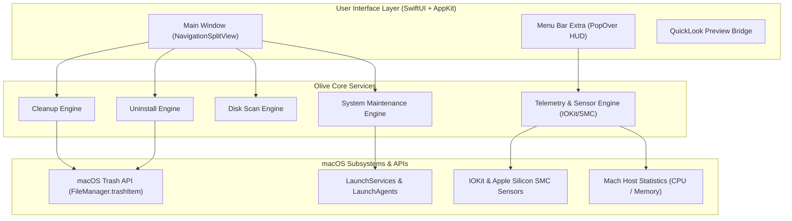

# Product Requirements Document (PRD)

## Project: Olive
**Tagline**: *The Gentle, Privacy-First, Open-Source Mac Optimizer & System Monitor*  
**License**: GNU General Public License v3.0 (GPL-3.0)  
**Target Platform**: macOS 14.0 (Sonoma) and macOS 15.0+ (Sequoia), Apple Silicon & Intel  
**Architecture**: Native Swift & SwiftUI + Modular System Telemetry Engine

---

## 1. Executive Summary

### 1.1 Problem Statement
Mac users lack a genuinely free, open-source, privacy-first native application that combines comprehensive system cleaning, leftover-free application uninstallation, disk space exploration, and real-time hardware monitoring. Existing commercial alternatives (such as CleanMyMac, DaisyDisk, iStat Menus) charge recurring subscriptions or steep one-time fees, while command-line tools lack visual accessibility for everyday users.

### 1.2 Objective
Olive delivers an all-in-one native macOS application that provides visual clarity, deep system cleaning, and real-time telemetry with zero telemetry, zero advertisements, and zero paywalls.

---

## 2. Core Feature Modules

### Module 1: Deep System Cleanup (`CleanerModule`)
- **System & User Caches**: Safely scans and removes stale application caches (`~/Library/Caches`, `/Library/Caches`).
- **Developer Artifacts**: Identifies disposable build folders (`node_modules`, `DerivedData`, `.build`, `target`, `venv`, Xcode simulator cryptexes).
- **Log Files & Crash Reports**: Purges legacy diagnostic logs (`~/Library/Logs`, `/Library/Logs/DiagnosticReports`).
- **Browser Data**: Cleans cache and temporary storage for Safari, Chrome, Firefox, Arc, and Brave.
- **Orphan Leftovers**: Scans for remaining files from already-deleted applications.
- **Trash Manager**: Calculates individual volume trash sizes and empties securely.
- **Safety First**: Every item defaults to a detailed **Dry-Run Review** modal where the user can inspect each file path before taking action.

### Module 2: Smart App Uninstaller (`UninstallerModule`)
- **Application Discovery**: Automatically indexes `/Applications` and `~/Applications`.
- **Deep Dependency Resolution**: Maps all related files:
  - `~/Library/Application Support/<AppName>`
  - `~/Library/Caches/<BundleIdentifier>`
  - `~/Library/Preferences/<BundleIdentifier>.plist`
  - `~/Library/Saved Application State/<BundleIdentifier>.savedState`
  - `~/Library/WebKit/<BundleIdentifier>`
  - `/Library/LaunchAgents` & `~/Library/LaunchAgents`
- **Batch Uninstallation**: Multi-select support to remove multiple unused apps at once.
- **Safe Removal**: Moves items to the macOS Trash (`FileManager.default.trashItem`) to ensure undoability.

### Module 3: Visual Disk Space Analyzer (`DiskMapperModule`)
- **Sunburst & Treemap Visualizer**: Interactive hierarchical visualization of disk consumption.
- **Interactive Navigation**: Click to zoom into directories, breadcrumb bar for navigation.
- **Large & Old Files Finder**: Instant filters for files > 500MB, > 1GB, or untouched for > 90 days.
- **QuickLook Integration**: Press `Spacebar` on any file or folder to preview instantly via native macOS QuickLook.

### Module 4: Live System Telemetry & Menu Bar HUD (`MonitorModule`)
- **Menu Bar Item (`MenuBarExtra`)**:
  - Live CPU % gauge, Memory pressure badge, Battery level, and Active Fan RPM.
- **HUD Popover**:
  - **CPU**: Real-time per-core utilization graphs, thermal throttling state.
  - **Memory**: Active, Wired, Compressed, and Free breakdown with pressure indicator.
  - **Disk I/O**: Real-time read/write throughput (MB/s).
  - **Network**: Live download/upload speed meters.
  - **Hardware Sensors**: CPU/GPU thermal sensors and Fan speed control indicators.
  - **Top Processes**: Dynamic list of high-impact CPU and memory tasks.

### Module 5: System Optimization & Maintenance (`MaintenanceModule`)
- **Flush DNS Cache**: Instant DNS resolver refresh (`dscacheutil -flushcache; killall -HUP mDNSResponder`).
- **Rebuild QuickLook Cache**: Clears and restarts QuickLook thumbnail server (`qlmanage -r cache`).
- **Re-index Spotlight**: Triggers Spotlight re-indexing for corrupted search indexes.
- **Startup Manager**: Disables or removes persistent background Login Items and LaunchAgents.

---

## 3. Non-Functional Requirements

### 3.1 Performance & Resource Footprint
- **Memory Usage**: < 30 MB RAM while idling in the Menu Bar.
- **CPU Overhead**: < 0.5% average CPU consumption during background monitoring.
- **Launch Time**: < 400ms cold startup.

### 3.2 Security & Safety Guarantees
- **No Dangerous `rm -rf`**: Deletions use the macOS Trash API (`NSWorkspace.shared.recycle` / `FileManager.trashItem`) so users can restore files if needed.
- **SIP & System Directory Protection**: Hardcoded exclusions for `/System`, `/usr`, `/bin`, `/sbin`, `/System/Library`, and active OS runtime files.
- **Explicit Confirmation**: High-impact maintenance actions require explicit user confirmation.
- **Privilege Separation**: Actions requiring administrator privileges clearly explain the reason and request standard macOS authentication.

### 3.3 Privacy & Data Governance
- **Zero Telemetry**: No analytics, tracking tokens, network phoning, or usage statistics.
- **100% Local**: All disk indexing and sensor queries execute exclusively on the user's Mac.
- **Open Source**: Full source code distributed under GPL-3.0 for auditability.

---

## 4. System Architecture

---

## 5. Success Metrics
- **Performance**: Instantaneous UI responsiveness, zero lag during 100GB+ disk scans.
- **Safety**: 0 reports of critical system file deletion.
- **Adoption**: Easy installation via Homebrew Cask and pre-built DMG releases.
