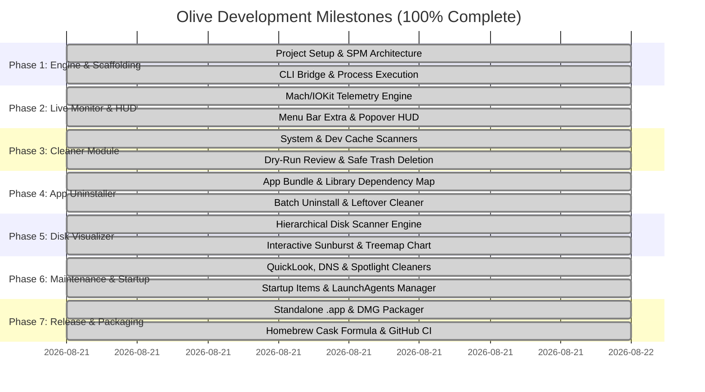

# Development Roadmap

## Project: Olive
**Goal**: *From initial prototype to a community-ready, open-source macOS app release.*

---

---

## Detailed Milestone Breakdown

### 🎯 Milestone 1: Foundation & Core Scaffolding (Completed ✅)
- [x] Select project name & branding (**Olive** 🫒).
- [x] Create PRD, Design System, Roadmap, Security & Privacy specs.
- [x] Initialize Git repository & `.gitignore`.
- [x] Set up Swift Package structure for macOS 14+.
- [x] Implement `ProcessRunner` to execute background commands and parse JSON output safely.

### 🎯 Milestone 2: Live Monitor & Menu Bar HUD (Completed ✅)
- [x] Build `SystemMonitorService` in Swift:
  - [x] CPU usage (User, System, Idle, per-core) via `host_processor_info`.
  - [x] Memory statistics (Active, Inactive, Wired, Compressed, Free) matching Activity Monitor formula.
  - [x] Disk space & filesystem analysis matching macOS Finder APFS Important/Available capacity.
  - [x] Network throughput tracking via `getifaddrs`.
  - [x] Real-time 0–100 Health Score algorithm.
- [x] Implement `MenuBarExtra` system tray item in top macOS bar.
- [x] Build dynamic `MenuBarHUDView` popover with live telemetry.

### 🎯 Milestone 3: Deep System Cleaner (Completed ✅)
- [x] Build `CleanerService` with scanning rules for:
  - [x] User Caches (`~/Library/Caches`)
  - [x] Developer Artifacts (`node_modules`, `DerivedData`, `.build`, `.npm`, `Cargo`, Homebrew)
  - [x] Diagnostic & Application Logs (`~/Library/Logs`, `/Library/Logs/DiagnosticReports`)
  - [x] Browser Caches (Chrome, Safari, Arc)
  - [x] System Trash (`~/.Trash`)
- [x] Implement `CategoryDetailSheet`: interactive item-level inspector with individual checkboxes and "Reveal in Finder" buttons.
- [x] Safe deletion implementation via `FileManager.default.trashItem(at:resultingItemURL:)`.

### 🎯 Milestone 4: Smart App Uninstaller (Completed ✅)
- [x] App scanner for `/Applications` and `~/Applications`.
- [x] Native high-res app icon extraction via `AppIconView` (`NSWorkspace.shared.icon`).
- [x] Residual artifact resolver for:
  - [x] `Application Support`, `Caches`, `Preferences`, `Saved Application State`, `WebKit`.
- [x] Uninstaller UI with live search, size badges, and complete leftover inspection sheet.

### 🎯 Milestone 5: Visual Disk Space Analyzer (Completed ✅)
- [x] Non-blocking multi-level directory tree crawler (`DiskNode`).
- [x] Custom Canvas-rendered interactive `SunburstChartView` with radial concentric rings, hover detection, and click-to-drill-down.
- [x] Interactive breadcrumb navigation trail (`Home > Library > ...`).
- [x] Dedicated Large Files Finder tab (>100MB / >1GB) with direct Trash and Finder reveal actions.

### 🎯 Milestone 6: System Maintenance & Startup Manager (Completed ✅)
- [x] Quick maintenance actions:
  - [x] Flush DNS Cache (`dscacheutil`, `mDNSResponder`)
  - [x] Rebuild QuickLook Cache (`qlmanage`)
  - [x] Re-index Spotlight Search (`mdimport`)
  - [x] Purge Inactive Memory (`purge`)
- [x] **Startup Items & LaunchAgents Manager**:
  - [x] Scan `~/Library/LaunchAgents`, `/Library/LaunchAgents`, and `/Library/LaunchDaemons`.
  - [x] Enable/disable toggle switches via `launchctl`.
  - [x] Plist inspect in Finder & safe move to Trash.

### 🎯 Milestone 7: Release & Packaging (Completed ✅)
- [x] Standalone **`Olive.app`** bundle builder script (`scripts/build_app.sh`).
- [x] High-resolution squircle App Icon generator (`scripts/generate_app_icon.swift`).
- [x] **`Olive-1.0.0.dmg`** installer generator for drag-and-drop install into `/Applications`.
- [x] Homebrew Cask formula (`Casks/olive.rb` for `brew install --cask olive`).
- [x] Automated GitHub Releases CI/CD workflow (`.github/workflows/release.yml`).
