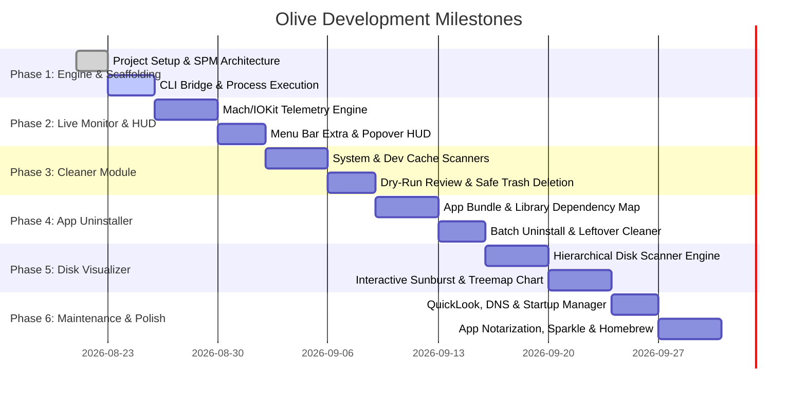

# Development Roadmap

## Project: Olive
**Goal**: *From initial prototype to a community-ready, open-source macOS app release.*

---

---

## Detailed Milestone Breakdown

### 🎯 Milestone 1: Foundation & Core Scaffolding
- [x] Select project name & branding (**Olive**).
- [x] Create PRD, Design System, Roadmap, Security & Privacy specs.
- [x] Initialize Git repository & `.gitignore`.
- [ ] Set up Swift Package / Xcode structure for macOS 14+.
- [ ] Implement `AsyncProcessRunner` to execute background commands and parse JSON output safely.

### 🎯 Milestone 2: Live Monitor & Menu Bar HUD
- [ ] Build `TelemetryEngine` in Swift:
  - CPU usage (User, System, Idle, per-core) via `host_processor_info`.
  - Memory statistics (Active, Inactive, Wired, Compressed, Free) via `host_statistics64`.
  - Disk space & I/O via `statfs` and `DADiskCopyDescription`.
  - Network throughput tracking via `getifaddrs`.
- [ ] Implement `MenuBarExtra` system tray icon with configurable badge modes (CPU / RAM / Fan).
- [ ] Build dynamic HUD Popover with live sparkline charts.

### 🎯 Milestone 3: Deep System Cleaner
- [ ] Build `CleanerEngine` with scanning rules for:
  - User Caches (`~/Library/Caches`)
  - Developer Artifacts (`node_modules`, `DerivedData`, `.build`, `target`, `venv`)
  - Diagnostic & Application Logs (`~/Library/Logs`)
  - Browser Caches (Chrome, Safari, Firefox, Arc, Brave)
  - Trash folders across internal and external volumes
- [ ] Implement `CleanupReviewSheet`: interactive tree review with size calculations and multi-select.
- [ ] Safe deletion implementation via `FileManager.default.trashItem(at:resultingItemURL:)`.

### 🎯 Milestone 4: Smart App Uninstaller
- [ ] App scanner for `/Applications` and `~/Applications`.
- [ ] Residual artifact resolver for:
  - `Application Support`, `Caches`, `Preferences`, `Saved Application State`, `WebKit`, `LaunchAgents`.
- [ ] Uninstaller UI with search, size sorting, and bulk selection.

### 🎯 Milestone 5: Visual Disk Space Analyzer
- [ ] Multi-threaded fast directory tree crawler.
- [ ] Custom SwiftUI / Canvas `SunburstChartView` and `TreemapView`.
- [ ] QuickLook integration (trigger preview on `Spacebar`).
- [ ] Large & Old Files filter table (>500MB, >1GB, >90 days unaccessed).

### 🎯 Milestone 6: System Maintenance & Startup Manager
- [ ] Quick maintenance actions:
  - Flush DNS Cache (`dscacheutil`, `mDNSResponder`)
  - Rebuild QuickLook Cache (`qlmanage`)
  - Re-index Spotlight Search (`mdimport`, `mdutil`)
- [ ] Login Items and LaunchAgents viewer & toggle switch.

### 🎯 Milestone 7: Open-Source Community Release (v1.0)
- [ ] Integrate **Sparkle Framework** for automated updates.
- [ ] Set up GitHub Actions workflow for automatic DMG builds and releases.
- [ ] Create Homebrew Cask formula (`brew install --cask olive`).
- [ ] Publish documentation, screenshots, and community contribution guidelines.
