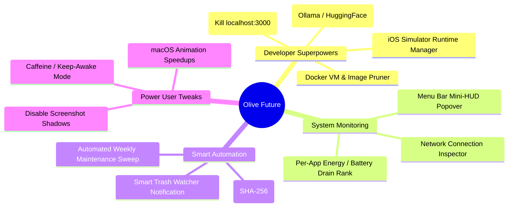

# 🫒 Olive — Product Vision, Brainstorming & Future Roadmap

<div align="center">
  <p>
    
    
    
    
    
  </p>
</div>

> **Mission Statement**: To become the #1 open-source, privacy-first macOS utility suite in the world — the undisputed, 100% free alternative to CleanMyMac X, DaisyDisk, iStat Menus, and Hazel combined.

---

## 🎯 1. Our North Star: The End Goal

| Core Pillar | What It Means for Olive |
| :--- | :--- |
| **1. Zero Subscriptions** | 100% Free & Open Source under GPL-3.0. No paywalls, no $40/year recurring subscriptions, and no trial limits. |
| **2. Pure Native Performance** | Built exclusively in pure Swift 6 + SwiftUI + AppKit. Zero Electron, zero web bloat, &lt;15 MB app size, and &lt;0.5% idle CPU impact. |
| **3. Absolute Privacy** | Zero telemetry, zero analytics pings, zero tracking. Runs completely offline. User files and project names never leave the Mac. |
| **4. Developer-First Superpowers** | Tailored specifically for modern developers (Node, Next.js, Python, Rust, Docker, Xcode, Ollama/AI models). |

---

## 🧠 2. Brainstorming: What We Can Improve & Add Next



---

## 🚀 3. Proposed Feature Modules (Ranked by Impact)

### Phase 1: High-Impact Developer Superpowers 🛠️

#### 1. 🤖 AI & Local LLM Model Cleaner
* **The Problem**: Developers using Ollama, LM Studio, Hugging Face, and PyTorch accumulate **30–100 GB** of `.gguf` and `.safetensors` model weights in `~/.ollama/models` and `~/.cache/huggingface` that are forgotten.
* **Olive Solution**: A dedicated **AI Models** card in Dev Clean showing installed LLMs (Llama 3, DeepSeek, Mistral, Qwen) with size, parameter count, and 1-click deletion.

#### 2. 🐳 Docker & Container Pruner
* **The Problem**: `Docker.raw` virtual disks grow to 60+ GB with dangling images, dead build cache layers, and unused volumes.
* **Olive Solution**: Safe, native UI to view and purge dangling Docker images, builder caches, and orphaned volumes.

#### 3. 🔌 Active Port & Localhost Manager
* **The Problem**: Developers constantly run into `Error: listen EADDRINUSE: address already in use :::3000`.
* **Olive Solution**: A mini tab showing all active listening ports (`:3000`, `:5173`, `:8080`, `:5432`) with the process name and a 1-click **"Kill Port"** button.

---

### Phase 2: Menu Bar Companion & Ambient Intelligence 📊

#### 4. 🪟 Menu Bar Mini-HUD Popover
* **Concept**: A sleek, minimal Olive icon in the macOS Menu Bar.
* **Capabilities**:
  * Live CPU % and RAM meter in the menu bar.
  * Clicking the icon opens a lightweight glassmorphic popover with CPU cores, RAM pressure, top 3 memory-hogging apps, and a **"Quick Clean"** button without opening the main window.

#### 5. 🗑️ Smart Trash Watcher (Hazel / CleanMyMac Killer)
* **Concept**: Background file system watcher (`FSEvents`).
* **Behavior**: When a user drags an application from `/Applications` to the Trash in Finder, Olive triggers a gentle native macOS notification:
  > *"Olive detected you moved Slack to Trash. Clean 1.4 GB of leftover support files?"*

---

### Phase 3: Storage Intelligence & Duplicates 💽

#### 6. 👥 Duplicate File Finder
* **Concept**: Fast, multi-threaded SHA-256 hash scanner to find identical duplicate photos, documents, and video downloads.
* **Safety**: Allows auto-selecting the oldest copy and moving duplicates safely to Trash.

#### 7. 🧹 Empty Folder & Broken Symlink Cleaner
* **Concept**: Scans project repositories and downloads for leftover empty directory trees and orphaned `.DS_Store` files.

---

### Phase 4: macOS Power Tweaks & Optimization ⚡

#### 8. ☕ Caffeine / Keep-Awake Toggle
* Prevents Mac from sleeping during long downloads or compiles using native `IOPMAssertionCreateWithName`.

#### 9. 🎛️ System Customization Suite
* One-click toggle switches to:
  * Show/Hide hidden files in Finder.
  * Disable screenshot drop-shadows (cleaner screenshots).
  * Accelerate Dock & Mission Control animation speeds.
  * Clear DNS and flush font caches.

---

## 🗺️ 4. Release Roadmap Overview

```
v1.0.0 (Current)  -->  v1.1.0 (Developer+)  -->  v1.2.0 (Menu Bar HUD)  -->  v2.0.0 (The Ultimate Suite)
- 8-Card Status        - AI Models Cache        - Menu Bar Popover          - Smart Trash Watcher
- Deep Clean           - Docker Pruner          - Active Port Manager       - Duplicate Finder
- Dev Clean (.next)    - Simulator Runtimes     - Per-App Energy Drain      - macOS Power Tweaks
- DaisyDisk Map        - Homebrew Tap           - Background Automation     - Multi-language UI
```

---

## 🤝 5. Open-Source Lineage & Credits

* **Voltster & Akritrim**: Native SwiftUI desktop application architecture, Canvas visualizers, and packaging.
* **Tw93 ([Mole](https://github.com/tw93/mole))**: Inspiration for CLI cleanliness and macOS deep cleaning scripts.

> 💡 **Prefer the command line?** Check out the fantastic CLI tool [Mole by Tw93](https://github.com/tw93/mole) at [mole.fit](https://mole.fit/)!

